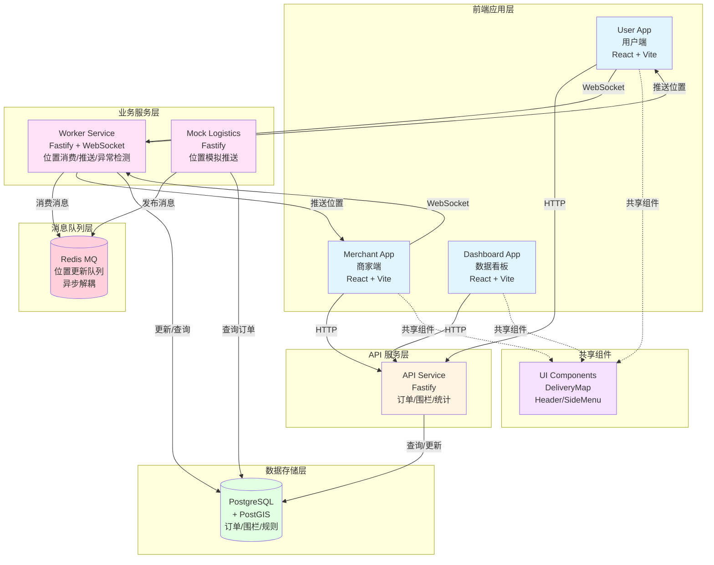
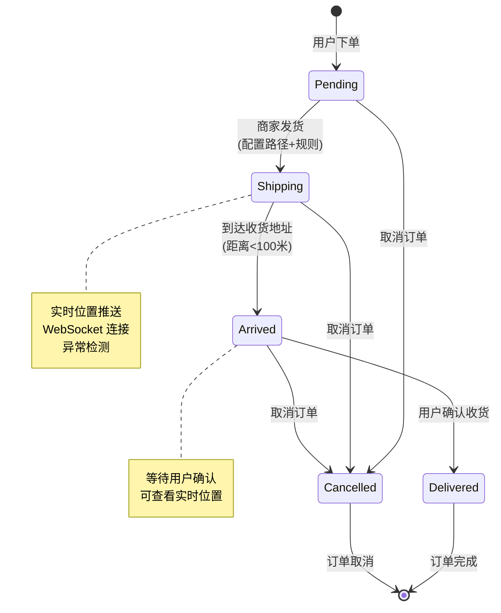
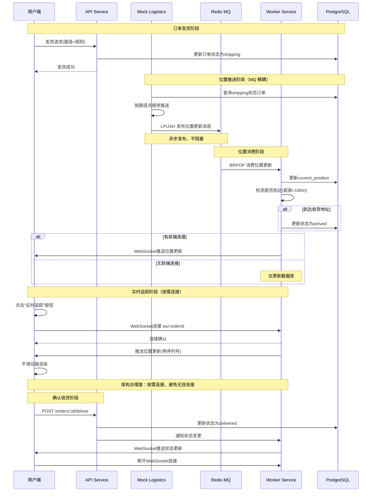

# 智能物流配送系统 - 项目答辩文档

## 一、项目概述

本项目是一个基于 **Turborepo Monorepo** 架构的智能物流配送系统，实现了从订单创建、配送管理到实时追踪的完整业务流程。系统采用微服务架构，支持多端应用（用户端、商家端、数据看板），提供实时位置追踪、配送围栏配置、异常检测等核心功能。

### 1.1 项目背景

随着电商和本地生活服务的快速发展，物流配送的实时性和准确性成为用户体验的关键因素。本系统旨在构建一个高效、可扩展的智能物流配送平台，支持：

- 实时订单追踪
- 智能配送范围管理
- 多时效配送规则
- 异常订单监控
- 数据统计分析

### 1.2 技术选型

- **Monorepo**: Turborepo（统一构建、缓存优化）
- **包管理**: pnpm（高效依赖管理）
- **后端框架**: Fastify（高性能 HTTP 框架）
- **数据库**: PostgreSQL + PostGIS（地理空间数据支持）
- **消息队列**: Redis（基于 List 的轻量级 MQ，实现服务解耦）
- **前端框架**: React + Vite + TypeScript
- **实时通信**: WebSocket
- **容器化**: Docker + Docker Compose
- **CI/CD**: GitHub Actions

---

## 二、产品设计

### 2.1 用户角色

系统支持三类用户角色：

1. **普通用户（User）**

   - **订单查询**：通过订单号查询包裹实时物流信息
   - **订单列表**：查看我的订单列表，支持状态筛选和统计
   - **订单详情**：地图+物流状态时间线双视图展示
   - 实时追踪订单配送（WebSocket 连接）
   - 确认收货

2. **商家（Merchant）**

   - 订单管理（查看、搜索、筛选、分页）
   - **批量发货**：支持多订单批量选择，系统规划最优配送路径
   - **地图路线预览**：发货前预览配送路径，支持路径选择和优化
   - 订单发货（配置配送路径、选择时效规则）
   - **配送区域管理**：设置配送范围，筛选区域内待发货订单
   - 配送围栏配置（多边形/圆形围栏）
   - 订单详情查看

3. **管理员（Dashboard）**
   - 数据统计大屏
   - 异常订单监控
   - 车辆轨迹展示
   - 配送热力图

### 2.2 核心业务流程

```
用户下单 → 配送范围校验 → 订单创建 → 商家发货 →
实时位置推送 → 到达检测 → 用户确认收货 → 订单完成
```

### 2.3 产品特色

1. **智能配送范围管理**：支持多边形和圆形围栏，自动判断订单是否在配送范围内
2. **多时效配送规则**：支持不同配送时效（如60分钟达、标准配送等）
3. **实时位置追踪**：WebSocket 实时推送，平滑动画展示
4. **高可靠位置更新**：基于 MQ 的消息队列机制，确保位置更新不丢失
5. **异常订单监控**：自动检测超时、位置更新异常等情况
6. **数据统计分析**：多维度数据统计，支持省份/城市/月份分组
7. **服务解耦架构**：Mock Logistics 和 Worker 通过 MQ 异步通信，支持独立扩展

---

## 三、核心功能

### 3.1 订单管理

#### 3.1.1 订单创建

- **配送范围校验**：使用 PostGIS 的 `ST_Covers` 和 `ST_DWithin` 函数判断收货地址是否在配送围栏内
- **自动匹配规则**：根据围栏关联的 `rule_id` 自动匹配配送时效规则
- **订单状态初始化**：创建时状态为 `pending`

#### 3.1.2 订单发货

**单订单发货**：

- **地图路线预览**：商家在发货前可预览配送路径
- **路径规划**：调用高德地图 API 规划配送路径（支持多个中转站）
- **路径选择**：系统提供多条路径方案，商家可选择最优路径
- **时效规则选择**：根据配送范围自动匹配或手动选择
- **状态变更**：`pending` → `shipping`
- **路径存储**：使用 PostGIS `LineString` 类型存储完整配送路径

**批量发货（多点配送）**：

- **订单选择**：商家批量选择多个待发货订单
- **路径规划**：系统根据所有订单的收货地址，规划最优多点配送路径
- **路径预览**：在发货确认页展示完整的多点配送路径
- **统一发货**：确认后，所有选中订单同时发货
- **用户视角**：用户端只看到自己订单的路径（多点路径的子集或完整路径）

#### 3.1.3 订单查询

**商家端订单查询**：

- **分页查询**：支持分页、排序、筛选
- **多条件搜索**：支持订单号、收件人、地址模糊搜索
- **状态筛选**：按订单状态筛选
- **时间范围查询**：支持按创建时间范围查询
- **配送范围筛选**：根据设置的配送范围筛选订单

**用户端订单查询**：

- **订单号查询**：通过订单号查询包裹实时物流信息
- **我的订单列表**：查看所有订单，支持状态筛选和统计
- **订单详情**：地图+物流状态时间线双视图展示
  - 地图视图：展示配送路径和当前位置
  - 物流状态时间线：支持收起/半开/全展开三种状态

### 3.2 实时位置追踪

#### 3.2.1 位置推送机制（基于 MQ 架构）

- **Mock Logistics 服务**：
  - 持续推送所有路径点，不依赖前端连接
  - 通过 Redis MQ 异步发布位置更新消息
  - 使用 LPUSH 将消息推入队列，实现非阻塞发布
- **Redis MQ**：
  - 作为消息中间层，解耦 Mock Logistics 和 Worker 服务
  - 使用 List 数据结构，保证 FIFO 顺序
  - 支持多 Worker 实例并行消费，提升吞吐量
- **Worker 服务**：
  - 从 MQ 消费位置更新消息（BRPOP 阻塞式消费）
  - 智能推送策略：
    - 有前端连接：更新数据库 + WebSocket 推送
    - 无前端连接：仅更新数据库（降低系统开销）
- **序列号保证**：确保轨迹点按顺序处理，处理乱序和丢失

#### 3.2.2 前端实时展示

- **WebSocket 连接**：手动触发连接（点击"实时追踪"按钮）
  - **架构合理度**：按需连接，避免无效连接占用资源
  - **符合实际场景**：如果即将到达收货地，再建立连接
- **平滑动画**：使用 `requestAnimationFrame` 实现小车移动动画（1秒动画）
- **路径渲染**：动态显示已走过的路径和规划路径
- **地图自适应**：地图比例根据展示尺寸自动调整，使路径尽量占满地图
- **状态更新**：实时接收订单状态变更通知

### 3.3 配送围栏管理

#### 3.3.1 围栏类型

- **多边形围栏**：支持任意多边形区域（GeoJSON Polygon 格式）
- **圆形围栏**：支持圆心+半径的圆形区域

#### 3.3.2 围栏配置

- **可视化编辑**：基于高德地图的围栏绘制和拖拽编辑
- **规则关联**：每个围栏关联一个配送时效规则
- **CRUD 操作**：支持创建、查询、更新、删除围栏
- **配送范围设置**：商家可设置配送范围，用于筛选订单

#### 3.3.3 配送范围业务逻辑

- **范围筛选订单**：
  - 商家设置配送范围 A（GeoJSON Polygon）
  - 系统筛选出所有收货地址在 A 内的"待发货"订单
  - 支持商家只对特定区域的订单进行配送的场景
- **动态范围修改**：
  - 商家可随时修改配送范围
  - 修改后重新筛选符合条件的订单
  - 支持商家根据业务需求灵活调整配送策略

#### 3.3.4 配送范围校验

- **PostGIS 空间查询**：
  - 多边形：`ST_Covers(geometry, point)` 或 `ST_Within(point, geometry)`
  - 圆形：`ST_DWithin(geometry, point, radius)`
- **自动匹配规则**：返回匹配的 `rule_id`

### 3.4 异常检测

#### 3.4.1 检测规则（基于时间差计算）

- **Pending 订单**：
  - 检测条件：`当前时间 - 订单创建时间 > 2小时`
  - 异常原因：`"待发货时间超过2小时"`
- **Shipping 订单**：
  - **配送超时**：`当前时间 - 发货时间 > 4小时`
    - 异常原因：`"配送时间超过4小时"`
  - **位置更新异常**：`当前时间 - 最后位置更新时间 > 5分钟`
    - 异常原因：`"位置更新间隔超过5分钟"`

#### 3.4.2 检测机制

- **定时检测**：Worker 服务每30秒检测一次
- **时间差计算**：通过计算各阶段时间差来判断异常
- **自动标记**：检测到异常自动更新 `is_abnormal = true` 和 `abnormal_reason`
- **异常阶段识别**：根据异常发生的阶段提供不同的 `reason`
- **实时监控**：Dashboard 实时展示异常订单列表

### 3.5 数据统计

#### 3.5.1 基础统计

- **总单数**：所有订单数量
- **完成率**：已完成订单 / 总订单数
- **物流动态**：最近更新的订单状态变更

#### 3.5.2 地理统计

- **分省统计**：按省份统计订单数量
- **分市统计**：按城市统计订单数量
- **热力图**：收货位置热力图展示

#### 3.5.3 时效统计

- **平均配送时间**：按省份或月份分组统计
- **车辆轨迹**：正在配送的订单轨迹展示

---

## 四、技术架构

### 4.1 系统架构图



### 4.2 服务职责

#### 4.2.1 API Service (Port: 3000)

- **订单管理**：创建、查询、发货、确认收货
- **围栏管理**：CRUD 操作、配送范围校验
- **规则管理**：配送时效规则查询
- **数据统计**：多维度数据统计接口

#### 4.2.2 Worker Service (Port: 3006)

**核心职责**：

- **MQ 消费**：从 Redis 队列消费位置更新消息
- **WebSocket 管理**：管理前端 WebSocket 连接
- **智能推送**：根据连接状态决定是否推送
- **异常检测**：定时检测异常订单（基于时间差计算）
- **到达检测**：检测订单是否到达收货地址

**架构合理度**：

- **独立服务设计**：将实时物流数据处理从主 API 服务中分离
- **资源隔离**：WebSocket 长连接维护不影响主 API 性能
- **可扩展性**：支持多实例部署，通过负载均衡器分发连接
- **职责单一**：专注于订单在 `shipping` 状态后的实时处理任务

#### 4.2.3 Mock Logistics Service (Port: 3005)

- **位置模拟**：模拟物流车辆位置推送
- **MQ 发布**：通过 Redis 队列发布位置更新（异步解耦）
- **持续推送**：按 `rule_id` 确定的间隔持续推送
- **路径追踪**：按照规划的路径点顺序推送

#### 4.2.4 Redis MQ (Port: 6379)

- **消息队列**：基于 Redis List 实现的轻量级消息队列
- **异步通信**：解耦 Mock Logistics 和 Worker 服务
- **FIFO 保证**：使用 LPUSH/BRPOP 实现先进先出
- **高可用**：支持多 Worker 实例消费，提升系统吞吐量

### 4.3 数据架构

#### 4.3.1 核心数据表

**orders 表**

```sql
- id: UUID (主键)
- user_id: VARCHAR (用户ID)
- merchant_id: VARCHAR (商家ID)
- status: VARCHAR (订单状态: pending/pickedUp/shipping/arrived/delivered/cancelled)
- amount: NUMERIC (订单金额)
- recipient_coords: GEOGRAPHY(Point) (收货地址坐标)
- current_position: GEOGRAPHY(Point) (当前位置)
- route_path: GEOGRAPHY(LineString) (配送路径，支持多点配送)
- rule_id: INTEGER (配送规则ID，影响位置推送间隔)
- is_abnormal: BOOLEAN (是否异常，通过时间差计算)
- abnormal_reason: TEXT (异常原因，如"待发货时间超过2小时")
- create_time: TIMESTAMP (创建时间，用于异常检测)
- last_update_time: TIMESTAMP (最后更新时间)
- ship_time: TIMESTAMP (发货时间，用于异常检测)
```

**fences 表**

```sql
- id: SERIAL (主键)
- merchant_id: VARCHAR (商家ID)
- fence_name: VARCHAR (围栏名称)
- fence_desc: TEXT (围栏描述)
- rule_id: INTEGER (关联规则ID)
- shape_type: VARCHAR (形状类型: polygon/circle)
- radius: NUMERIC (圆形半径，米)
- geometry: GEOGRAPHY (PostGIS 几何对象)
```

**delivery_rules 表**

```sql
- id: INTEGER (主键)
- name: VARCHAR (规则名称)
- logic: TEXT (规则逻辑描述)
- created_at: TIMESTAMP (创建时间)
```

#### 4.3.2 地理空间数据

- **PostGIS 扩展**：支持地理空间数据类型和函数
- **GEOGRAPHY 类型**：使用 WGS84 坐标系（SRID: 4326）
- **空间索引**：使用 GIST 索引优化空间查询性能

### 4.4 技术亮点

#### 4.4.1 Monorepo 架构

- **统一构建**：Turborepo 支持增量构建和缓存
- **代码共享**：共享 UI 组件、类型定义、工具函数
- **依赖管理**：pnpm workspace 统一管理依赖

#### 4.4.2 智能推送策略

- **连接感知**：只在有前端连接时才通过 WebSocket 推送
- **数据库优先**：无论是否有连接，都更新数据库保证数据完整性
- **序列号保证**：确保轨迹点按顺序处理

#### 4.4.3 消息队列解耦架构

**业务价值**：

- **服务解耦**：Mock Logistics 和 Worker 通过 MQ 异步通信，降低耦合度
- **削峰填谷**：位置更新消息先入队，Worker 按自身处理能力消费
- **容错能力**：Worker 服务异常时，消息保留在队列中，恢复后继续处理
- **可扩展性**：支持多 Worker 实例并行消费，提升系统吞吐量

**技术实现**：

- **轻量级方案**：基于 Redis List 的 LPUSH/BRPOP，无需引入 RabbitMQ/Kafka 等重型 MQ
- **FIFO 保证**：使用 List 数据结构天然保证消息顺序
- **阻塞式消费**：BRPOP 支持阻塞等待（超时 1 秒），降低 CPU 占用
- **轮询机制**：Worker 每 100ms 轮询一次，平衡实时性和资源消耗
- **消息格式**：`{ orderId, coordinates, merchantId, timestamp }` JSON 序列化

**技术选型思考**：

- 为什么选择 Redis 而非 RabbitMQ：项目规模适中，Redis 足够满足需求，运维成本低
- 为什么选择 List 而非 Stream：List 的 LPUSH/BRPOP 更简单，满足 FIFO 需求
- 未来扩展：如需要更高吞吐量或更多 MQ 特性，可平滑迁移到 RabbitMQ

#### 4.4.4 架构合理度设计

**1. 独立 Worker Service 的合理性**

**问题分析**：

- 大量订单实时物流数据的模拟推送，需要后端高频 `setInterval` 循环和 I/O
- 异常监控需要长时间运行轮询来独立处理复杂的时效计算和位置计算
- WebSocket 推送需要维护大量长连接，严重消耗进程资源

**架构决策**：

- **独立应用设计**：将 Worker Service 从主 API 服务中分离
- **资源隔离**：避免阻塞主 API 的事件循环，保证 API 快速响应
- **职责分离**：专注于订单在 `shipping` 状态后的实时处理任务

**架构优势**：

- ✅ 主 API 服务保持轻量，专注于业务逻辑处理
- ✅ Worker Service 可独立扩展，不影响主服务
- ✅ 支持多 Worker 实例部署，通过负载均衡器分发 WebSocket 连接
- ✅ 单个 Worker 实例达到连接上限时，可独立增加实例

**2. WebSocket 连接策略的合理性**

**连接时机**：

- **按需连接**：用户点击"实时追踪"按钮时才建立 WebSocket 连接
- **符合实际需求**：如果即将到达收货地，再建立连接，符合实际生产场景
- **资源优化**：避免大量无效连接占用系统资源

**连接管理**：

- **智能推送**：只在有前端连接时才通过 WebSocket 推送
- **数据库优先**：无论是否有连接，都更新数据库保证数据完整性
- **序列号保证**：确保轨迹点按顺序处理，处理乱序和丢失

**3. MQ 解耦的合理性**

**问题分析**：

- Mock Logistics 和 Worker 直接 HTTP 调用存在耦合
- Worker 异常时会导致位置更新丢失
- 难以支持多 Worker 实例并行处理

**架构决策**：

- **消息队列解耦**：通过 Redis MQ 实现异步通信
- **削峰填谷**：位置更新高峰期，消息先入队，Worker 按能力消费
- **容错机制**：Worker 异常时消息保留，恢复后继续处理

**架构优势**：

- ✅ 服务完全解耦，独立扩展
- ✅ 提升系统可靠性和容错能力
- ✅ 支持水平扩展，提升吞吐量

#### 4.4.4 地理空间计算

- **PostGIS 原生支持**：使用数据库层面的空间计算，性能优异
- **多种围栏类型**：支持多边形和圆形围栏
- **距离计算**：使用 Haversine 公式计算两点间距离

---

## 五、订单状态流转

### 5.1 状态定义

```typescript
enum OrderStatus {
  Pending = "pending", // 待处理
  PickedUp = "pickedUp", // 已取件
  Shipping = "shipping", // 运输中
  Arrived = "arrived", // 已到达
  Delivered = "delivered", // 已签收
  Cancelled = "cancelled", // 已取消
}
```

### 5.2 状态流转图



### 5.3 状态流转说明

#### 5.3.1 Pending → Shipping

**单订单发货流程**：

- **触发条件**：商家点击"发货"按钮
- **前端操作**：
  - 调用高德地图 API 规划配送路径
  - 商家预览并选择最优路径
  - 选择配送时效规则（影响位置推送间隔）
- **后端处理**：
  - 更新订单状态为 `shipping`
  - 保存配送路径 `route_path`（LineString）
  - 保存配送规则 `rule_id`
  - 更新 `last_update_time`
- **后续流程**：
  - Mock Logistics 服务检测到 `shipping` 状态订单
  - 根据 `rule_id` 确定位置推送间隔（101: 500ms, 102: 1000ms, 103: 2000ms）
  - 开始通过 Redis MQ 发布位置更新消息
  - Worker 服务从 MQ 消费消息并处理

**批量发货流程（多点配送）**：

- **触发条件**：商家批量选择多个订单，点击"批量发货"
- **路径规划**：
  - 系统根据所有订单的收货地址，规划最优多点配送路径
  - 在发货确认页展示完整的多点配送路径
- **统一发货**：
  - 确认后，所有选中订单同时更新为 `shipping` 状态
  - 每个订单保存自己的路径（多点路径的子集或完整路径）
- **用户视角**：
  - 用户端只看到自己订单的路径（多点路径的子集或完整路径）
  - 不影响用户的实时追踪体验

#### 5.3.2 Shipping → Arrived

- **触发条件**：当前位置距离收货地址 < 100米
- **检测机制**：Worker 服务每次接收位置更新时检测
- **操作内容**：
  - 更新订单状态为 `arrived`
  - 通过 WebSocket 推送状态变更通知
- **后续流程**：等待用户确认收货

#### 5.3.3 Arrived → Delivered

- **触发条件**：用户点击"确认收货"按钮
- **操作内容**：
  - 更新订单状态为 `delivered`
  - 更新 `last_update_time`
  - 通知 Worker 服务状态变更
- **后续流程**：订单完成，断开 WebSocket 连接

### 5.4 实时追踪流程



---

## 六、核心功能详解

### 6.1 配送范围校验

#### 6.1.1 校验流程

1. 用户下单时提供收货地址坐标 `[lng, lat]`
2. API Service 调用 `checkDeliveryRange()` 函数
3. 使用 PostGIS 空间查询：
   - 多边形围栏：`ST_Covers(geometry, point)`
   - 圆形围栏：`ST_DWithin(geometry, point, radius)`
4. 返回匹配结果和 `rule_id`

#### 6.1.2 代码示例

```typescript
// 检查配送范围
const checkResult = await OrderRepository.checkDeliveryRange(recipientCoords);

if (!checkResult.isDeliverable) {
  throw new Error("收货地址不在配送范围内");
}

// 使用匹配的规则ID创建订单
const order = await OrderRepository.createOrder(data, checkResult.ruleId);
```

### 6.2 智能位置推送（基于 MQ 架构）

#### 6.2.1 MQ 架构设计

**业务思考**：

- **问题**：Mock Logistics 和 Worker 服务直接 HTTP 调用存在耦合，Worker 异常时会导致位置更新丢失
- **方案**：引入消息队列实现异步解耦，提升系统可靠性和可扩展性
- **价值**：
  - 服务解耦：Mock Logistics 只需发布消息，不关心 Worker 处理状态
  - 容错能力：Worker 异常时消息保留在队列，恢复后继续处理
  - 可扩展性：支持多 Worker 实例并行消费，提升吞吐量
  - 削峰填谷：位置更新高峰期，消息先入队，Worker 按能力消费

**技术实现**：

- **发布端（Mock Logistics）**：
  - 使用 `ioredis` 客户端连接 Redis
  - 通过 `LPUSH` 将位置更新消息推入队列
  - 消息格式：`{ orderId, coordinates, merchantId, timestamp }`
- **消费端（Worker）**：
  - 使用 `BRPOP` 阻塞式消费（超时 1 秒）
  - 轮询机制：每 100ms 尝试消费一次
  - 消费后调用 `LocationReceiver` 处理位置更新

#### 6.2.2 推送策略

- **Mock Logistics**：持续推送，通过 MQ 异步发布，不阻塞
- **Worker Service**：
  - 维护 `ordersWithFrontendConnection` Set
  - 有连接：更新数据库 + WebSocket 推送
  - 无连接：仅更新数据库（降低系统开销）

#### 6.2.3 序列号机制

- 每个位置更新携带递增序列号
- 前端维护消息队列，按序列号顺序处理
- 处理乱序和丢失情况

### 6.3 异常检测（基于时间差计算）

#### 6.3.1 检测规则（基于时间差计算）

```typescript
const ANOMALY_RULES = {
  maxPendingTime: 2 * 60 * 60 * 1000, // 2小时
  maxShippingTime: 4 * 60 * 60 * 1000, // 4小时
  maxPositionUpdateGap: 5 * 60 * 1000, // 5分钟
};
```

**检测逻辑**：

- **Pending 订单异常**：
  - 计算：`当前时间 - 订单创建时间`
  - 判断：如果 > 2小时，标记为异常
  - 原因：`"待发货时间超过2小时"`
- **Shipping 订单异常**：
  - **配送超时**：`当前时间 - 发货时间 > 4小时`
    - 原因：`"配送时间超过4小时"`
  - **位置更新异常**：`当前时间 - 最后位置更新时间 > 5分钟`
    - 原因：`"位置更新间隔超过5分钟"`

#### 6.3.2 检测实现

- **定时检测**：Worker Service 定时任务（30秒间隔）
- **时间差计算**：通过计算各阶段时间差来判断异常
- **自动标记**：检测到异常自动更新 `is_abnormal = true` 和 `abnormal_reason`
- **异常阶段识别**：根据异常发生的阶段提供不同的 `reason`，便于问题定位

---

## 七、技术亮点总结

### 7.1 架构设计

1. **Monorepo 架构**：统一构建、代码共享、依赖管理
2. **微服务设计**：职责清晰、易于扩展
3. **消息队列解耦**：基于 Redis MQ 实现服务异步通信，提升系统可靠性
4. **地理空间支持**：PostGIS 原生支持，性能优异

### 7.2 性能优化

1. **智能推送策略**：降低无连接时的系统开销
2. **MQ 削峰填谷**：位置更新高峰期通过队列缓冲，Worker 按能力消费
3. **并行查询**：Dashboard 统计数据并行查询
4. **空间索引**：GIST 索引优化空间查询

### 7.3 用户体验

1. **实时追踪**：WebSocket 实时推送，延迟低
2. **平滑动画**：`requestAnimationFrame` 实现流畅动画
3. **异常监控**：自动检测并提示异常订单
4. **可靠性保障**：MQ 机制确保位置更新不丢失

### 7.4 可扩展性

1. **规则化配置**：配送规则可配置，易于扩展
2. **围栏灵活**：支持多种围栏类型（多边形/圆形），支持任意多边形区域
3. **MQ 水平扩展**：支持多 Worker 实例并行消费，提升吞吐量
4. **服务解耦**：Mock Logistics 和 Worker 通过 MQ 完全解耦，独立扩展
5. **批量处理**：支持批量发货和多点配送路径规划，提升商家操作效率

### 7.5 架构合理度

#### 7.5.1 服务分离的合理性

- **主 API 服务**：专注于业务逻辑处理，保持轻量和快速响应
- **Worker Service**：独立处理实时物流数据，避免阻塞主服务
- **Mock Logistics**：独立模拟位置推送，通过 MQ 解耦

#### 7.5.2 连接策略的合理性

- **按需连接**：用户点击"实时追踪"时才建立 WebSocket 连接
- **符合实际场景**：如果即将到达收货地，再建立连接，符合生产需求
- **资源优化**：避免大量无效连接占用系统资源

#### 7.5.3 异常检测的合理性

- **基于时间差计算**：通过计算各阶段时间差来判断异常，逻辑清晰
- **定时检测**：Worker 服务每30秒检测一次，平衡实时性和性能
- **异常阶段识别**：根据异常发生的阶段提供不同的 `reason`，便于问题定位

---

## 八、项目总结

本项目实现了一个完整的智能物流配送系统，涵盖了从订单创建到实时追踪的完整业务流程。系统采用现代化的技术栈和架构设计，具有良好的可扩展性和性能表现。

### 8.1 核心成果

- ✅ 完整的订单生命周期管理（支持批量发货和多点配送）
- ✅ 实时位置追踪系统（基于 MQ 的高可靠架构）
- ✅ 智能配送范围管理（支持任意多边形区域，动态筛选订单）
- ✅ 异常订单自动检测（基于时间差计算的智能检测机制）
- ✅ 多维度数据统计分析
- ✅ 消息队列解耦架构（提升系统可靠性和可扩展性）
- ✅ 架构合理度设计（服务分离、按需连接、资源优化）

### 8.2 技术价值

- 展示了 Monorepo 架构在实际项目中的应用
- 验证了 PostGIS 在地理空间计算中的优势
- 实现了高效的实时通信机制（WebSocket + MQ）
- 提供了可扩展的微服务架构设计
- **消息队列解耦实践**：展示了轻量级 MQ 在微服务架构中的应用，平衡了系统复杂度和可靠性
- **架构合理度设计**：通过服务分离、按需连接等策略，实现了高性能和高可用的系统架构
- **业务场景适配**：支持批量发货、多点配送等实际业务场景，提升商家操作效率

### 8.3 业务思考与技术亮点

#### 8.3.1 消息队列选型思考

- **为什么选择 Redis 而非 RabbitMQ/Kafka**：

  - 项目规模：中小型项目，Redis 足够满足需求
  - 运维成本：Redis 更轻量，部署简单，无需额外中间件
  - 性能要求：位置更新频率适中（500ms-2s），Redis List 性能足够
  - 学习成本：团队熟悉 Redis，降低学习成本

- **技术亮点**：
  - **轻量级实现**：基于 Redis List 的 LPUSH/BRPOP，无需引入重型 MQ
  - **FIFO 保证**：使用 List 数据结构天然保证消息顺序
  - **阻塞式消费**：BRPOP 支持阻塞等待，降低 CPU 占用
  - **容错机制**：Worker 异常时消息保留，恢复后继续处理

#### 8.3.2 架构演进思考

- **第一阶段（HTTP 直接调用）**：
  - 问题：服务耦合、容错能力弱、难以扩展
- **第二阶段（MQ 解耦）**：
  - 改进：异步通信、削峰填谷、支持水平扩展
  - 价值：提升了系统可靠性和可扩展性

#### 8.3.3 架构合理度总结

**1. 服务分离的合理性**

- **问题**：大量订单实时物流数据模拟推送、异常监控轮询、WebSocket 长连接维护，容易阻塞主 API
- **方案**：独立 Worker Service，专注于 `shipping` 状态后的实时处理任务
- **价值**：主 API 保持轻量快速响应，Worker 可独立扩展

**2. WebSocket 连接策略的合理性**

- **问题**：如果所有订单都建立连接，会消耗大量系统资源
- **方案**：按需连接，用户点击"实时追踪"时才建立连接
- **价值**：符合实际生产场景，避免无效连接占用资源

**3. MQ 解耦的合理性**

- **问题**：Mock Logistics 和 Worker 直接 HTTP 调用存在耦合，容错能力弱
- **方案**：通过 Redis MQ 实现异步通信，支持多实例消费
- **价值**：服务完全解耦，提升可靠性和可扩展性

**4. 异常检测机制的合理性**

- **问题**：需要实时监控订单状态，判断是否异常
- **方案**：基于时间差计算，定时检测各阶段时间差
- **价值**：逻辑清晰，易于维护和扩展

### 8.4 未来优化方向

1. **性能优化**：批量推送、缓存机制、消息压缩
2. **功能扩展**：路径优化、配送预测、智能调度
3. **监控完善**：APM 监控、日志分析、队列监控
4. **安全增强**：认证授权、数据加密、消息签名
5. **MQ 升级**：如需要更高吞吐量，可考虑迁移到 RabbitMQ 或 Kafka

---

## 附录

### A. 项目结构

```
my-turborepo/
├── apps/
│   ├── api/              # API 服务
│   ├── user/             # 用户端
│   ├── merchant/         # 商家端
│   ├── dashboard/        # 数据看板
│   ├── worker/           # Worker 服务
│   └── mock-logistics/   # Mock 物流服务
├── packages/
│   ├── ui/               # 共享 UI 组件
│   ├── eslint-config/     # ESLint 配置
│   └── typescript-config/ # TypeScript 配置
└── docs/                 # 文档目录
```

### B. 服务端口

- API Service: 3000
- User App: 5173
- Merchant App: 3001
- Dashboard App: 3002
- Worker Service: 3006
- Mock Logistics: 3005
- Redis MQ: 6379

### C. 关键技术文档

- `docs/OPTIMIZATION_DELIVERY_TRACKING.md` - 轨迹推送优化方案
- `docs/API_DOCUMENTATION.md` - API 接口文档
- `docs/DASHBOARD_ARCHITECTURE.md` - 数据看板架构
- `docs/TESTING_GUIDE.md` - 测试指南
