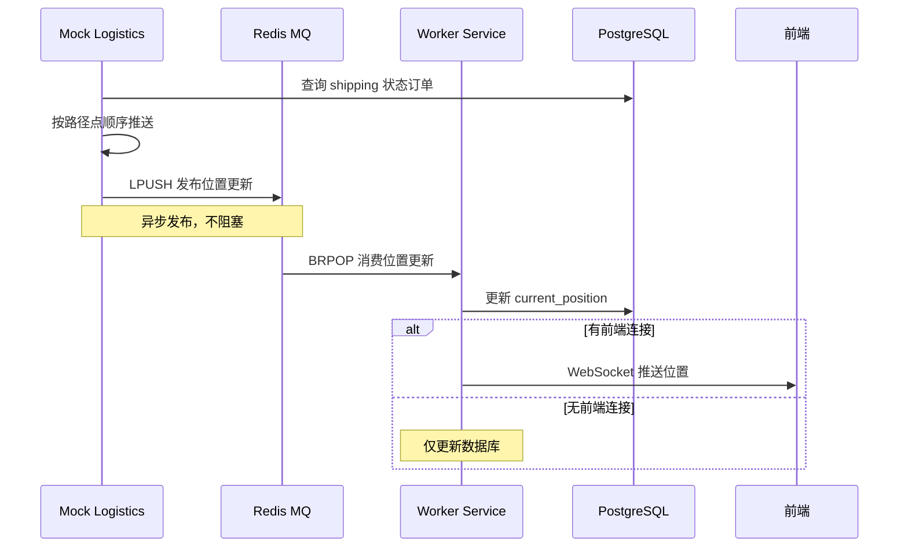
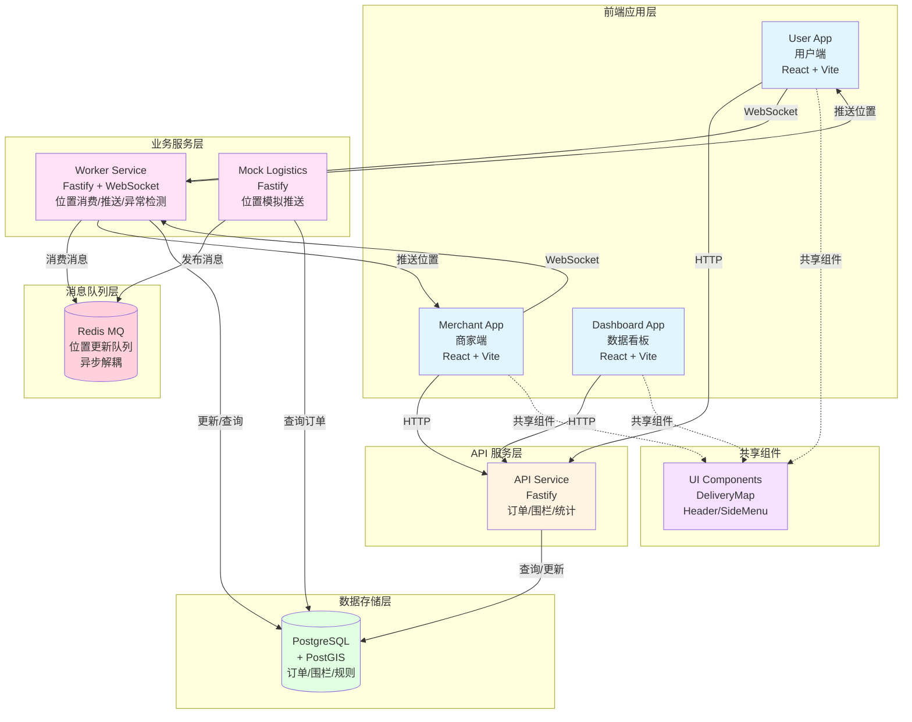
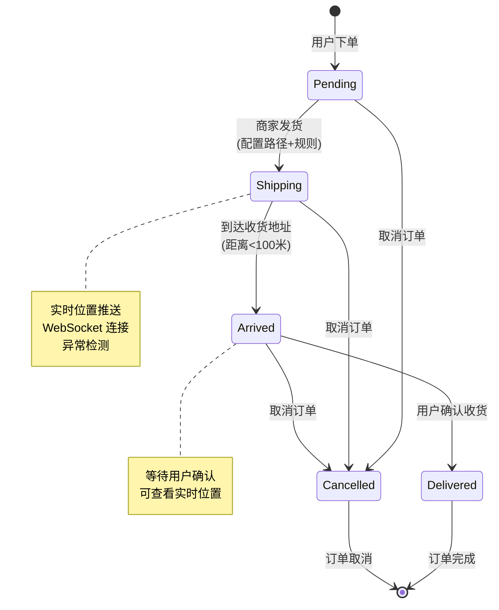
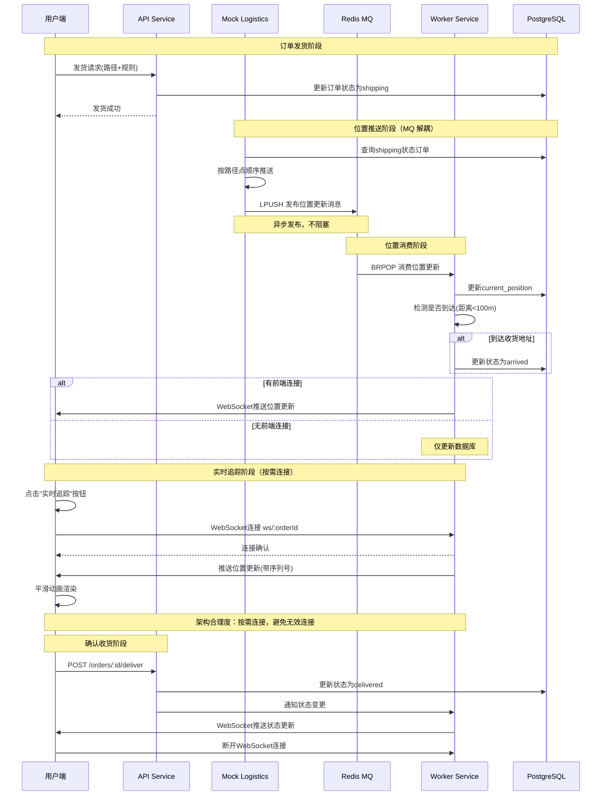
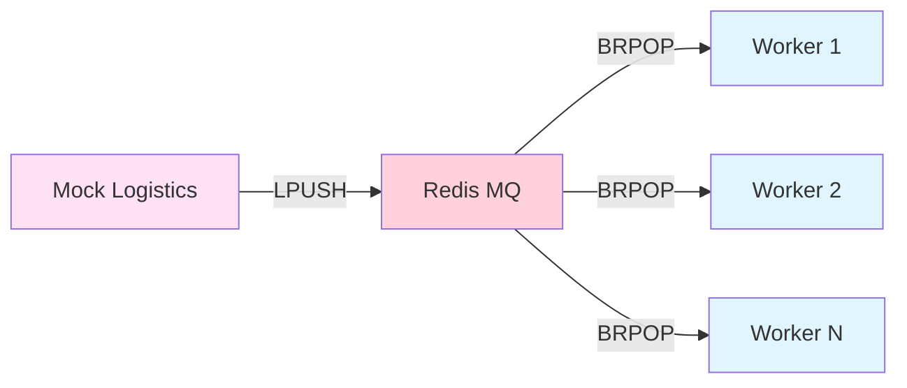
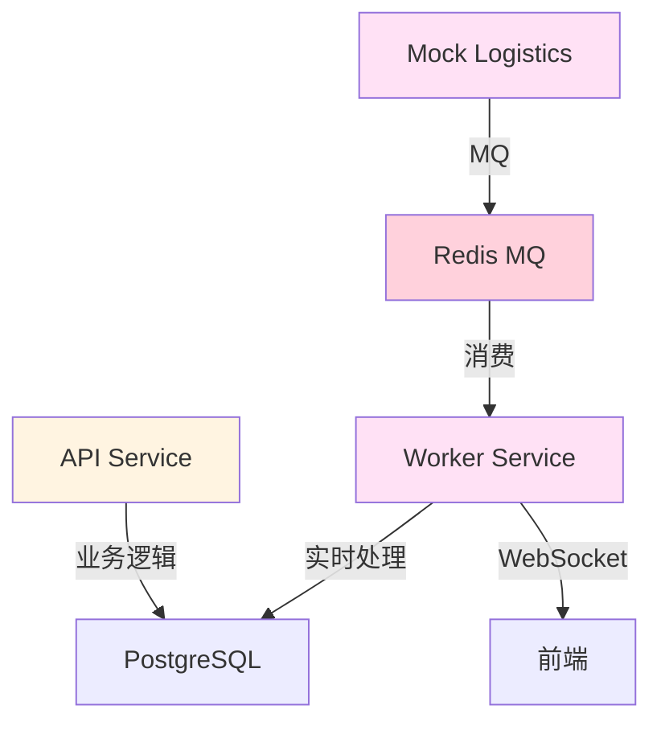

# 智能物流配送系统 - 项目答辩文档

---

## 📋 目录

1. [项目概述](#项目概述)
2. [产品设计](#产品设计)
3. [核心功能](#核心功能)
4. [系统架构设计](#系统架构设计) ⭐
5. [技术选型](#技术选型) ⭐
6. [业务场景思考与创新](#业务场景思考与创新) ⭐
7. [技术亮点总结](#技术亮点总结)
8. [项目成果](#项目成果)

---

## 一、项目概述

### 1.1 项目背景

随着电商和本地生活服务的快速发展，物流配送的实时性和准确性成为用户体验的关键因素。本系统旨在构建一个**高效、可扩展的智能物流配送平台**，支持：

- ✅ 实时订单追踪
- ✅ 智能配送范围管理
- ✅ 多时效配送规则
- ✅ 异常订单监控
- ✅ 数据统计分析

### 1.2 项目定位

基于 **Turborepo Monorepo** 架构的智能物流配送系统，实现了从订单创建、配送管理到实时追踪的完整业务流程。系统采用**微服务架构**，支持多端应用（用户端、商家端、数据看板），提供实时位置追踪、配送围栏配置、异常检测等核心功能。

### 1.3 技术栈概览

| 类别         | 技术选型                  | 说明                |
| ------------ | ------------------------- | ------------------- |
| **Monorepo** | Turborepo                 | 统一构建、缓存优化  |
| **包管理**   | pnpm                      | 高效依赖管理        |
| **后端框架** | Fastify                   | 高性能 HTTP 框架    |
| **数据库**   | PostgreSQL + PostGIS      | 地理空间数据支持    |
| **消息队列** | Redis (List)              | 轻量级 MQ，服务解耦 |
| **前端框架** | React + Vite + TypeScript | 现代化前端技术栈    |
| **实时通信** | WebSocket                 | 实时位置推送        |
| **容器化**   | Docker + Docker Compose   | 容器化部署          |
| **CI/CD**    | GitHub Actions            | 自动化构建部署      |

---

## 二、产品设计

### 2.1 用户角色与功能

#### 👤 普通用户（User）

**核心功能**：

- 📦 **订单查询**：通过订单号查询包裹实时物流信息
- 📋 **订单列表**：查看我的订单列表，支持状态筛选和统计
- 🗺️ **订单详情**：地图+物流状态时间线双视图展示
- 🚚 **实时追踪**：WebSocket 实时位置追踪（按需连接）
- ✅ **确认收货**：订单到达后确认收货

#### 🏪 商家（Merchant）

**核心功能**：

- 📦 **订单管理**：查看、搜索、筛选、分页
- 🚀 **批量发货**：支持多订单批量选择，系统规划最优配送路径
- 🗺️ **地图路线预览**：发货前预览配送路径，支持路径选择和优化
- 📍 **配送区域管理**：设置配送范围，筛选区域内待发货订单
- 🔲 **配送围栏配置**：多边形/圆形围栏可视化编辑
- 📊 **订单详情查看**：实时追踪订单配送状态

#### 📊 管理员（Dashboard）

**核心功能**：

- 📈 **数据统计大屏**：总单数、完成率、物流动态
- ⚠️ **异常订单监控**：实时监控异常订单
- 🚗 **车辆轨迹展示**：正在配送的订单轨迹
- 🔥 **配送热力图**：收货位置热力图展示

### 2.2 核心业务流程


### 2.3 产品特色

1. **智能配送范围管理**：支持多边形和圆形围栏，自动判断订单是否在配送范围内
2. **多时效配送规则**：支持不同配送时效（如60分钟达、标准配送等）
3. **实时位置追踪**：WebSocket 实时推送，平滑动画展示
4. **高可靠位置更新**：基于 MQ 的消息队列机制，确保位置更新不丢失
5. **异常订单监控**：自动检测超时、位置更新异常等情况
6. **数据统计分析**：多维度数据统计，支持省份/城市/月份分组
7. **服务解耦架构**：Mock Logistics 和 Worker 通过 MQ 异步通信，支持独立扩展

---

## 三、核心功能

### 3.1 订单管理

#### 3.1.1 订单创建

- **配送范围校验**：使用 PostGIS 的 `ST_Covers` 和 `ST_DWithin` 函数判断收货地址是否在配送围栏内
- **自动匹配规则**：根据围栏关联的 `rule_id` 自动匹配配送时效规则
- **订单状态初始化**：创建时状态为 `pending`

#### 3.1.2 订单发货

**单订单发货**：

- **地图路线预览**：商家在发货前可预览配送路径
- **路径规划**：调用高德地图 API 规划配送路径（支持多个中转站）
- **路径选择**：系统提供多条路径方案，商家可选择最优路径
- **时效规则选择**：根据配送范围自动匹配或手动选择
- **状态变更**：`pending` → `shipping`
- **路径存储**：使用 PostGIS `LineString` 类型存储完整配送路径

**批量发货（多点配送）**：

- **订单选择**：商家批量选择多个待发货订单
- **路径规划**：系统根据所有订单的收货地址，规划最优多点配送路径
- **路径预览**：在发货确认页展示完整的多点配送路径
- **统一发货**：确认后，所有选中订单同时发货
- **用户视角**：用户端只看到自己订单的路径（多点路径的子集或完整路径）

#### 3.1.3 订单查询

**商家端订单查询**：

- **分页查询**：支持分页、排序、筛选
- **多条件搜索**：支持订单号、收件人、地址模糊搜索
- **状态筛选**：按订单状态筛选
- **时间范围查询**：支持按创建时间范围查询
- **配送范围筛选**：根据设置的配送范围筛选订单

**用户端订单查询**：

- **订单号查询**：通过订单号查询包裹实时物流信息
- **我的订单列表**：查看所有订单，支持状态筛选和统计
- **订单详情**：地图+物流状态时间线双视图展示

### 3.2 实时位置追踪

#### 3.2.1 位置推送机制（基于 MQ 架构）

**架构设计**：



**核心特点**：

- **Mock Logistics 服务**：持续推送所有路径点，不依赖前端连接
- **Redis MQ**：作为消息中间层，解耦 Mock Logistics 和 Worker 服务
- **Worker 服务**：从 MQ 消费位置更新消息，智能推送策略
- **序列号保证**：确保轨迹点按顺序处理，处理乱序和丢失

#### 3.2.2 前端实时展示

- **WebSocket 连接**：手动触发连接（点击"实时追踪"按钮）
- **平滑动画**：使用 `requestAnimationFrame` 实现小车移动动画（1秒动画）
- **路径渲染**：动态显示已走过的路径和规划路径
- **地图自适应**：地图比例根据展示尺寸自动调整，使路径尽量占满地图
- **状态更新**：实时接收订单状态变更通知

### 3.3 配送围栏管理

#### 3.3.1 围栏类型

- **多边形围栏**：支持任意多边形区域（GeoJSON Polygon 格式）
- **圆形围栏**：支持圆心+半径的圆形区域

#### 3.3.2 围栏配置

- **可视化编辑**：基于高德地图的围栏绘制和拖拽编辑
- **规则关联**：每个围栏关联一个配送时效规则
- **CRUD 操作**：支持创建、查询、更新、删除围栏
- **配送范围设置**：商家可设置配送范围，用于筛选订单

#### 3.3.3 配送范围业务逻辑

- **范围筛选订单**：商家设置配送范围 A（GeoJSON Polygon），系统筛选出所有收货地址在 A 内的"待发货"订单
- **动态范围修改**：商家可随时修改配送范围，修改后重新筛选符合条件的订单

### 3.4 异常检测

#### 3.4.1 检测规则（基于时间差计算）

```typescript
const ANOMALY_RULES = {
  maxPendingTime: 2 * 60 * 60 * 1000, // 2小时
  maxShippingTime: 4 * 60 * 60 * 1000, // 4小时
  maxPositionUpdateGap: 5 * 60 * 1000, // 5分钟
};
```

**检测逻辑**：

- **Pending 订单异常**：`当前时间 - 订单创建时间 > 2小时` → `"待发货时间超过2小时"`
- **Shipping 订单异常**：
  - **配送超时**：`当前时间 - 发货时间 > 4小时` → `"配送时间超过4小时"`
  - **位置更新异常**：`当前时间 - 最后位置更新时间 > 5分钟` → `"位置更新间隔超过5分钟"`

#### 3.4.2 检测机制

- **定时检测**：Worker 服务每30秒检测一次
- **时间差计算**：通过计算各阶段时间差来判断异常
- **自动标记**：检测到异常自动更新 `is_abnormal = true` 和 `abnormal_reason`
- **异常阶段识别**：根据异常发生的阶段提供不同的 `reason`，便于问题定位

### 3.5 数据统计

#### 3.5.1 基础统计

- **总单数**：所有订单数量
- **完成率**：已完成订单 / 总订单数
- **物流动态**：最近更新的订单状态变更

#### 3.5.2 地理统计

- **分省统计**：按省份统计订单数量
- **分市统计**：按城市统计订单数量
- **热力图**：收货位置热力图展示

#### 3.5.3 时效统计

- **平均配送时间**：按省份或月份分组统计
- **车辆轨迹**：正在配送的订单轨迹展示

---

## 四、系统架构设计 ⭐

### 4.1 整体架构图



### 4.2 服务职责详解

#### 4.2.1 API Service (Port: 3000)

**职责**：

- **订单管理**：创建、查询、发货、确认收货
- **围栏管理**：CRUD 操作、配送范围校验
- **规则管理**：配送时效规则查询
- **数据统计**：多维度数据统计接口

**设计特点**：

- 专注于业务逻辑处理，保持轻量和快速响应
- 不处理实时物流数据，避免阻塞主服务

#### 4.2.2 Worker Service (Port: 3006) ⭐

**核心职责**：

- **MQ 消费**：从 Redis 队列消费位置更新消息
- **WebSocket 管理**：管理前端 WebSocket 连接
- **智能推送**：根据连接状态决定是否推送
- **异常检测**：定时检测异常订单（基于时间差计算）
- **到达检测**：检测订单是否到达收货地址

**架构合理度设计**：

1. **独立服务设计**

   - **问题分析**：大量订单实时物流数据模拟推送、异常监控轮询、WebSocket 长连接维护，容易阻塞主 API
   - **架构决策**：将 Worker Service 从主 API 服务中分离
   - **架构优势**：
     - ✅ 主 API 服务保持轻量，专注于业务逻辑处理
     - ✅ Worker Service 可独立扩展，不影响主服务
     - ✅ 支持多 Worker 实例部署，通过负载均衡器分发 WebSocket 连接
     - ✅ 单个 Worker 实例达到连接上限时，可独立增加实例

2. **WebSocket 连接策略**

   - **按需连接**：用户点击"实时追踪"按钮时才建立 WebSocket 连接
   - **符合实际场景**：如果即将到达收货地，再建立连接，符合生产需求
   - **资源优化**：避免大量无效连接占用系统资源

3. **智能推送策略**
   - **连接感知**：维护 `ordersWithFrontendConnection` Set
   - **有前端连接**：更新数据库 + WebSocket 推送
   - **无前端连接**：仅更新数据库（降低系统开销）

#### 4.2.3 Mock Logistics Service (Port: 3005)

**职责**：

- **位置模拟**：模拟物流车辆位置推送
- **MQ 发布**：通过 Redis 队列发布位置更新（异步解耦）
- **持续推送**：按 `rule_id` 确定的间隔持续推送
- **路径追踪**：按照规划的路径点顺序推送

#### 4.2.4 Redis MQ (Port: 6379)

**职责**：

- **消息队列**：基于 Redis List 实现的轻量级消息队列
- **异步通信**：解耦 Mock Logistics 和 Worker 服务
- **FIFO 保证**：使用 LPUSH/BRPOP 实现先进先出
- **高可用**：支持多 Worker 实例消费，提升系统吞吐量

### 4.3 数据架构

#### 4.3.1 核心数据表

**orders 表**：

| 字段               | 类型                  | 说明         |
| ------------------ | --------------------- | ------------ |
| `id`               | UUID                  | 主键         |
| `user_id`          | VARCHAR               | 用户ID       |
| `merchant_id`      | VARCHAR               | 商家ID       |
| `status`           | VARCHAR               | 订单状态     |
| `amount`           | NUMERIC               | 订单金额     |
| `recipient_coords` | GEOGRAPHY(Point)      | 收货地址坐标 |
| `current_position` | GEOGRAPHY(Point)      | 当前位置     |
| `route_path`       | GEOGRAPHY(LineString) | 配送路径     |
| `rule_id`          | INTEGER               | 配送规则ID   |
| `is_abnormal`      | BOOLEAN               | 是否异常     |
| `abnormal_reason`  | TEXT                  | 异常原因     |
| `create_time`      | TIMESTAMP             | 创建时间     |
| `last_update_time` | TIMESTAMP             | 最后更新时间 |
| `ship_time`        | TIMESTAMP             | 发货时间     |

**fences 表**：

| 字段          | 类型      | 说明             |
| ------------- | --------- | ---------------- |
| `id`          | SERIAL    | 主键             |
| `merchant_id` | VARCHAR   | 商家ID           |
| `fence_name`  | VARCHAR   | 围栏名称         |
| `fence_desc`  | TEXT      | 围栏描述         |
| `rule_id`     | INTEGER   | 关联规则ID       |
| `shape_type`  | VARCHAR   | 形状类型         |
| `radius`      | NUMERIC   | 圆形半径         |
| `geometry`    | GEOGRAPHY | PostGIS 几何对象 |

#### 4.3.2 地理空间数据

- **PostGIS 扩展**：支持地理空间数据类型和函数
- **GEOGRAPHY 类型**：使用 WGS84 坐标系（SRID: 4326）
- **空间索引**：使用 GIST 索引优化空间查询性能

### 4.4 订单状态流转



### 4.5 实时追踪完整流程



---

## 五、技术选型 ⭐

### 5.1 技术选型对比分析

#### 5.1.1 Monorepo 架构：Turborepo

**选型理由**：

- ✅ **统一构建**：支持增量构建和缓存，提升构建效率
- ✅ **代码共享**：共享 UI 组件、类型定义、工具函数
- ✅ **依赖管理**：pnpm workspace 统一管理依赖，避免版本冲突
- ✅ **开发体验**：统一开发命令，简化开发流程

**对比其他方案**：

- **Lerna**：配置复杂，性能不如 Turborepo
- **Nx**：功能强大但学习曲线陡峭
- **pnpm workspace**：仅依赖管理，缺少构建优化

#### 5.1.2 后端框架：Fastify

**选型理由**：

- ✅ **高性能**：比 Express 快 2-3 倍
- ✅ **TypeScript 支持**：原生 TypeScript 支持
- ✅ **插件生态**：丰富的插件生态（WebSocket、CORS 等）
- ✅ **低开销**：低内存占用，适合高并发场景

**对比其他方案**：

- **Express**：性能较低，生态成熟但较老
- **Koa**：中间件机制优雅，但生态不如 Fastify
- **NestJS**：功能全面但重量级，适合大型项目

#### 5.1.3 数据库：PostgreSQL + PostGIS

**选型理由**：

- ✅ **地理空间支持**：PostGIS 原生支持地理空间数据类型和函数
- ✅ **性能优异**：数据库层面的空间计算，性能优于应用层计算
- ✅ **功能丰富**：支持多种围栏类型（多边形、圆形）
- ✅ **成熟稳定**：PostgreSQL 成熟稳定，PostGIS 生态完善

**对比其他方案**：

- **MySQL + 应用层计算**：性能较差，计算复杂
- **MongoDB**：地理空间支持有限，不适合复杂查询
- **Redis Geo**：仅支持简单地理查询，不适合复杂业务

#### 5.1.4 消息队列：Redis (List)

**选型理由**：

- ✅ **轻量级**：基于 Redis List 的 LPUSH/BRPOP，无需引入 RabbitMQ/Kafka
- ✅ **FIFO 保证**：使用 List 数据结构天然保证消息顺序
- ✅ **阻塞式消费**：BRPOP 支持阻塞等待，降低 CPU 占用
- ✅ **运维简单**：Redis 部署简单，运维成本低
- ✅ **容错机制**：Worker 异常时消息保留，恢复后继续处理

**对比其他方案**：

| 方案           | 优点                   | 缺点             | 适用场景                  |
| -------------- | ---------------------- | ---------------- | ------------------------- |
| **Redis List** | 轻量、简单、运维成本低 | 功能有限         | 中小型项目，消息量适中 ✅ |
| **RabbitMQ**   | 功能全面、可靠性高     | 重量级、运维复杂 | 大型项目，高可靠性要求    |
| **Kafka**      | 高吞吐、持久化         | 重量级、配置复杂 | 大数据场景，高吞吐要求    |

**技术选型思考**：

- **项目规模**：中小型项目，Redis 足够满足需求
- **运维成本**：Redis 更轻量，部署简单，无需额外中间件
- **性能要求**：位置更新频率适中（500ms-2s），Redis List 性能足够
- **学习成本**：团队熟悉 Redis，降低学习成本
- **未来扩展**：如需要更高吞吐量或更多 MQ 特性，可平滑迁移到 RabbitMQ

#### 5.1.5 前端框架：React + Vite + TypeScript

**选型理由**：

- ✅ **React**：生态成熟，组件化开发
- ✅ **Vite**：快速构建，开发体验好
- ✅ **TypeScript**：类型安全，提升代码质量
- ✅ **Ant Design**：UI 组件库，快速开发

#### 5.1.6 实时通信：WebSocket

**选型理由**：

- ✅ **低延迟**：双向通信，实时推送
- ✅ **资源占用**：相比轮询，资源占用更低
- ✅ **状态管理**：可维护连接状态，实现智能推送

**对比其他方案**：

- **HTTP 轮询**：延迟高，资源占用大
- **Server-Sent Events (SSE)**：仅支持服务端推送，不适合双向通信

### 5.2 技术选型总结

| 技术类别     | 选型                 | 核心优势           | 业务价值               |
| ------------ | -------------------- | ------------------ | ---------------------- |
| **Monorepo** | Turborepo            | 统一构建、缓存优化 | 提升开发效率，代码复用 |
| **后端框架** | Fastify              | 高性能、低开销     | 支持高并发，快速响应   |
| **数据库**   | PostgreSQL + PostGIS | 地理空间原生支持   | 高效处理地理查询       |
| **消息队列** | Redis (List)         | 轻量级、运维简单   | 服务解耦，提升可靠性   |
| **前端框架** | React + Vite         | 快速构建、类型安全 | 提升开发体验           |
| **实时通信** | WebSocket            | 低延迟、双向通信   | 实时位置追踪           |

---

## 六、业务场景思考与创新 ⭐

### 6.1 消息队列解耦架构

#### 6.1.1 业务场景分析

**问题场景**：

- Mock Logistics 服务需要持续推送位置更新
- Worker 服务需要处理位置更新并推送给前端
- 如果直接 HTTP 调用，存在以下问题：
  - 服务耦合：Mock Logistics 需要知道 Worker 地址
  - 容错能力弱：Worker 异常时位置更新丢失
  - 难以扩展：无法支持多 Worker 实例并行处理

**解决方案**：引入消息队列实现异步解耦

#### 6.1.2 架构设计



**技术实现**：

- **发布端（Mock Logistics）**：
  - 使用 `ioredis` 客户端连接 Redis
  - 通过 `LPUSH` 将位置更新消息推入队列
  - 消息格式：`{ orderId, coordinates, merchantId, timestamp }`
- **消费端（Worker）**：
  - 使用 `BRPOP` 阻塞式消费（超时 1 秒）
  - 轮询机制：每 100ms 尝试消费一次
  - 消费后调用 `LocationReceiver` 处理位置更新

#### 6.1.3 业务价值

1. **服务解耦**：Mock Logistics 只需发布消息，不关心 Worker 处理状态
2. **容错能力**：Worker 异常时消息保留在队列，恢复后继续处理
3. **可扩展性**：支持多 Worker 实例并行消费，提升吞吐量
4. **削峰填谷**：位置更新高峰期，消息先入队，Worker 按能力消费

#### 6.1.4 创新点

- **轻量级实现**：基于 Redis List 的 LPUSH/BRPOP，无需引入 RabbitMQ/Kafka 等重型 MQ
- **FIFO 保证**：使用 List 数据结构天然保证消息顺序
- **阻塞式消费**：BRPOP 支持阻塞等待，降低 CPU 占用
- **平滑扩展**：未来如需要更高吞吐量，可平滑迁移到 RabbitMQ

### 6.2 独立 Worker Service 设计

#### 6.2.1 业务场景分析

**问题场景**：

- 大量订单实时物流数据模拟推送，需要后端高频 `setInterval` 循环和 I/O
- 异常监控需要长时间运行轮询来独立处理复杂的时效计算和位置计算
- WebSocket 推送需要维护大量长连接，严重消耗进程资源
- 如果这些任务都在主 API 服务中，会阻塞主服务的事件循环

**解决方案**：独立 Worker Service，专注于实时处理任务

#### 6.2.2 架构设计



#### 6.2.3 业务价值

1. **资源隔离**：WebSocket 长连接维护不影响主 API 性能
2. **职责分离**：主 API 专注于业务逻辑，Worker 专注于实时处理
3. **独立扩展**：Worker Service 可独立扩展，不影响主服务
4. **高可用**：支持多 Worker 实例部署，通过负载均衡器分发连接

#### 6.2.4 创新点

- **按需连接**：用户点击"实时追踪"时才建立 WebSocket 连接，避免无效连接
- **智能推送**：根据连接状态决定是否推送，降低系统开销
- **序列号保证**：确保轨迹点按顺序处理，处理乱序和丢失

### 6.3 配送范围动态筛选

#### 6.3.1 业务场景分析

**业务需求**：

- 商家可能只想对特定区域的订单进行配送
- 商家可随时修改配送范围
- 需要根据配送范围筛选订单

**解决方案**：配送范围动态筛选

#### 6.3.2 技术实现

- **围栏设置**：商家设置配送范围 A（GeoJSON Polygon）
- **空间查询**：使用 PostGIS `ST_Within` 函数筛选订单
- **动态更新**：商家修改配送范围后，重新筛选符合条件的订单

#### 6.3.3 业务价值

- **灵活配送**：商家可根据业务需求灵活调整配送策略
- **精准筛选**：基于 PostGIS 空间查询，筛选精度高
- **实时更新**：配送范围修改后立即生效

### 6.4 批量发货与多点配送

#### 6.4.1 业务场景分析

**业务需求**：

- 商家需要同时处理多个订单
- 多个订单可能在同一配送路径上
- 需要规划最优配送路径

**解决方案**：批量发货与多点配送路径规划

#### 6.4.2 技术实现

- **订单选择**：商家批量选择多个待发货订单
- **路径规划**：调用高德地图 API 规划最优多点配送路径
- **路径预览**：在发货确认页展示完整的多点配送路径
- **统一发货**：确认后，所有选中订单同时发货

#### 6.4.3 业务价值

- **提升效率**：商家可批量处理订单，提升操作效率
- **路径优化**：系统自动规划最优配送路径，降低配送成本
- **用户体验**：用户端只看到自己订单的路径，不影响用户体验

### 6.5 异常检测机制

#### 6.5.1 业务场景分析

**业务需求**：

- 需要实时监控订单状态，判断是否异常
- 异常情况包括：待发货时间过长、配送超时、位置更新异常

**解决方案**：基于时间差计算的智能检测机制

#### 6.5.2 技术实现

- **定时检测**：Worker 服务每30秒检测一次
- **时间差计算**：通过计算各阶段时间差来判断异常
- **自动标记**：检测到异常自动更新 `is_abnormal = true` 和 `abnormal_reason`
- **异常阶段识别**：根据异常发生的阶段提供不同的 `reason`

#### 6.5.3 业务价值

- **实时监控**：自动检测异常订单，无需人工干预
- **问题定位**：根据异常原因快速定位问题
- **数据统计**：Dashboard 实时展示异常订单列表

### 6.6 业务场景思考总结

| 业务场景                | 问题分析             | 解决方案           | 创新点               |
| ----------------------- | -------------------- | ------------------ | -------------------- |
| **消息队列解耦**        | 服务耦合、容错能力弱 | Redis MQ 异步通信  | 轻量级实现，平滑扩展 |
| **独立 Worker Service** | 资源占用、性能阻塞   | 服务分离、按需连接 | 智能推送、序列号保证 |
| **配送范围筛选**        | 灵活配送需求         | PostGIS 空间查询   | 动态更新、精准筛选   |
| **批量发货**            | 操作效率低           | 多点配送路径规划   | 路径优化、批量处理   |
| **异常检测**            | 人工监控成本高       | 基于时间差计算     | 自动检测、问题定位   |

---

## 七、技术亮点总结

### 7.1 架构设计亮点

1. **Monorepo 架构**：统一构建、代码共享、依赖管理
2. **微服务设计**：职责清晰、易于扩展
3. **消息队列解耦**：基于 Redis MQ 实现服务异步通信，提升系统可靠性
4. **地理空间支持**：PostGIS 原生支持，性能优异
5. **独立 Worker Service**：资源隔离、职责分离、独立扩展

### 7.2 性能优化亮点

1. **智能推送策略**：降低无连接时的系统开销
2. **MQ 削峰填谷**：位置更新高峰期通过队列缓冲，Worker 按能力消费
3. **并行查询**：Dashboard 统计数据并行查询
4. **空间索引**：GIST 索引优化空间查询
5. **按需连接**：避免大量无效连接占用系统资源

### 7.3 用户体验亮点

1. **实时追踪**：WebSocket 实时推送，延迟低
2. **平滑动画**：`requestAnimationFrame` 实现流畅动画
3. **异常监控**：自动检测并提示异常订单
4. **可靠性保障**：MQ 机制确保位置更新不丢失
5. **批量操作**：支持批量发货，提升商家操作效率

### 7.4 可扩展性亮点

1. **规则化配置**：配送规则可配置，易于扩展
2. **围栏灵活**：支持多种围栏类型（多边形/圆形），支持任意多边形区域
3. **MQ 水平扩展**：支持多 Worker 实例并行消费，提升吞吐量
4. **服务解耦**：Mock Logistics 和 Worker 通过 MQ 完全解耦，独立扩展
5. **平滑迁移**：未来可平滑迁移到 RabbitMQ 等重型 MQ

---

## 八、项目成果

### 8.1 核心成果

- ✅ **完整的订单生命周期管理**（支持批量发货和多点配送）
- ✅ **实时位置追踪系统**（基于 MQ 的高可靠架构）
- ✅ **智能配送范围管理**（支持任意多边形区域，动态筛选订单）
- ✅ **异常订单自动检测**（基于时间差计算的智能检测机制）
- ✅ **多维度数据统计分析**
- ✅ **消息队列解耦架构**（提升系统可靠性和可扩展性）
- ✅ **架构合理度设计**（服务分离、按需连接、资源优化）

### 8.2 技术价值

- 展示了 **Monorepo 架构**在实际项目中的应用
- 验证了 **PostGIS** 在地理空间计算中的优势
- 实现了高效的**实时通信机制**（WebSocket + MQ）
- 提供了可扩展的**微服务架构设计**
- **消息队列解耦实践**：展示了轻量级 MQ 在微服务架构中的应用，平衡了系统复杂度和可靠性
- **架构合理度设计**：通过服务分离、按需连接等策略，实现了高性能和高可用的系统架构
- **业务场景适配**：支持批量发货、多点配送等实际业务场景，提升商家操作效率

### 8.3 项目数据

- **服务数量**：6 个应用服务（API、Worker、Mock Logistics、User、Merchant、Dashboard）
- **共享包**：4 个共享包（UI、HTTP Client、ESLint Config、TypeScript Config）
- **技术栈**：9 种核心技术（Turborepo、Fastify、PostgreSQL、PostGIS、Redis、React、Vite、TypeScript、WebSocket）
- **核心功能**：5 大核心功能模块（订单管理、实时追踪、围栏管理、异常检测、数据统计）

---

## 附录

### A. 项目结构

```
my-turborepo/
├── apps/
│   ├── api/              # API 服务
│   ├── user/             # 用户端
│   ├── merchant/         # 商家端
│   ├── dashboard/        # 数据看板
│   ├── worker/           # Worker 服务
│   └── mock-logistics/   # Mock 物流服务
├── packages/
│   ├── ui/               # 共享 UI 组件
│   ├── http-client/      # HTTP 客户端封装
│   ├── eslint-config/     # ESLint 配置
│   └── typescript-config/ # TypeScript 配置
└── docs/                 # 文档目录
```

### B. 服务端口

| 服务           | 端口 | 说明                |
| -------------- | ---- | ------------------- |
| API Service    | 3000 | 订单/围栏/统计接口  |
| User App       | 5173 | 用户端应用          |
| Merchant App   | 5174 | 商家端应用          |
| Dashboard App  | 5175 | 数据看板应用        |
| Worker Service | 3006 | WebSocket + MQ 消费 |
| Mock Logistics | 3005 | 位置模拟推送        |
| Redis MQ       | 6379 | 消息队列            |
| PostgreSQL     | 5432 | 数据库              |

### C. 关键技术文档

- `docs/API_DOCUMENTATION.md` - API 接口文档
- `docs/DASHBOARD_ARCHITECTURE.md` - 数据看板架构
- `docs/OPTIMIZATION_DELIVERY_TRACKING.md` - 轨迹推送优化方案
- `docs/TESTING_GUIDE.md` - 测试指南

---

**文档版本**：v1.0  
**最后更新**：2025年12月10日
